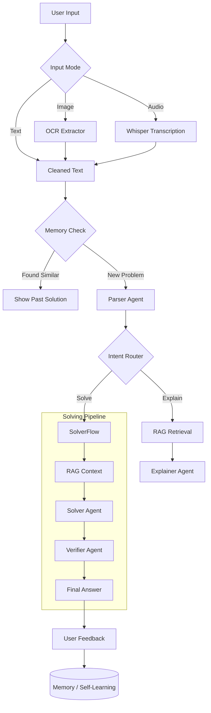

# 📘 Math Mentor AI

> **A Multi-Agent, Multimodal AI System for Solving & Explaining Math Problems.**


**Math Mentor AI** is an advanced educational tool designed to help students understand math, not just get the answer. It combines the power of symbolic computation (SymPy) with the flexibility of Large Language Models (LLMs) and RAG (Retrieval-Augmented Generation) to verify, solve, and explain problems step-by-step.

---

## 🏗️ Architecture

The system is built on a **Multi-Agent Architecture** where specialized agents collaborate to solve a problem.



---

## 🌟 Key Features

### 1. 🧠 Multi-Agent Framework
*   **Parser Agent**: Cleans user input, normalizes math notation (e.g., "three x squared" -> `3x^2`), and detects variables.
*   **Intent Router**: Intelligently decides if the user wants to *solve a problem*, *get an explanation*, or is just chitchatting.
*   **Solver Agent**: A deterministic symbolic solver using **SymPy**. It doesn't guess; it calculates.
*   **Verifier Agent**: Double-checks the solver's output against domain constraints to prevent hallucinations.
*   **Explainer Agent**: Translates mathematical steps into plain English for better understanding.
*   **Memory Agent**: Stores every interaction. If a user asks a question that was previously solved, the system instantly retrieves the correct answer from memory.

### 2. 👁️🎙️ Multimodal Inputs
*   **Text**: Type equations directly (LaTeX supported).
*   **Image**: Upload screenshots or photos of homework. The system uses **OCR** to extract the math.
*   **Audio**: Speak your problem! The system uses **Whisper** technology to transcribe speech to math.

### 3. 📚 RAG (Retrieval-Augmented Generation)
*   The system maintains a vector database (FAISS) of math concepts, definitions, and formulas.
*   Before solving, it retrieves relevant context (e.g., "Quadratic Formula Definition") to ground the agent's understanding.

### 4. 🔄 Human-in-the-Loop (HITL) & Self-Learning
*   **Correction Loop**: Users can edit extracted text from images/audio before processing.
*   **Feedback System**: Users can mark answers as "✅ Correct" or "❌ Incorrect".
*   **Learning**: Correct answers are saved to the Knowledge Graph (Memory), making the system smarter over time without retraining.

---

## 🛠️ Technology Stack

*   **Frontend**: [Streamlit](https://streamlit.io/)
*   **Orchestration**: Custom Agent Loop (inspired by LangGraph)
*   **Math Engine**: [SymPy](https://www.sympy.org/)
*   **Vector Query**: [FAISS](https://github.com/facebookresearch/faiss) & [SentenceTransformers](https://www.sbert.net/)
*   **OCR**: [EasyOCR](https://github.com/JaidedAI/EasyOCR)
*   **Audio**: [OpenAI Whisper](https://github.com/openai/whisper)

---

## 🚀 Getting Started

### Prerequisites
*   Python 3.10 or higher installed.
*   **FFmpeg** (Required for Audio processing).
    *   *Windows*: `winget install ffmpeg` OR download from [ffmpeg.org](https://ffmpeg.org/) and add to PATH.

### Installation

1.  **Clone the Repository**
    ```bash
    git clone https://github.com/your-username/math-mentor-ai.git
    cd math-mentor-ai
    ```

2.  **Create a Virtual Environment** (Recommended)
    ```bash
    python -m venv venv
    # Windows
    .\venv\Scripts\activate
    # Mac/Linux
    source venv/bin/activate
    ```

3.  **Install Dependencies**
    ```bash
    pip install -r requirements.txt
    ```
    *Note: This may take a few minutes as it installs Torch and Transformer models.*

4.  **Configuration**
    Copy the example environment file:
    ```bash
    copy .env.example .env
    ```
    *(No API keys are strictly required for the core solver, but if you extend with OpenAI, add your key here.)*

### Running the App

```bash
streamlit run app.py
```
The application will open in your default browser at `http://localhost:8501`.

---

## 📂 Directory Structure

```text
math_mentor_ai/
├── agents/                 # The "Brains" of the operation
│   ├── parser_agent.py     # Input cleaning & normalizing
│   ├── intent_router.py    # Decision making logic
│   ├── solver_agent.py     # SymPy math engine
│   ├── verifier_agent.py   # Quality assurance
│   ├── explainer_agent.py  # Natural language generation
│   └── memory_agent.py     # History & learning manager
├── multimodal/             # The "Senses"
│   ├── image_ocr.py        # Vision (EasyOCR)
│   ├── audio_asr.py        # Hearing (Whisper)
│   └── text_input.py       # Text constraints
├── rag/                    # The "Knowledge"
│   ├── index/              # Pre-computed FAISS vector store
│   ├── knowledge_base/     # Raw markdown math docs
│   └── retriever.py        # Search logic
├── data/                   # The "Memory"
│   └── memory.jsonl        # Database of solved problems
├── app.py                  # Main Entry Point (Streamlit UI)
├── requirements.txt        # Dependency list
└── README.md               # Documentation
```

---

## 📖 Usage Guide

### Solving a Math Problem
1.  Select **Input Mode**: Text.
2.  Type: `Solve x^2 - 5x + 6 = 0`.
3.  Click **Process**.
4.  Review the **Step-by-Step Solution**.
5.  Read the **AI Explanation**.
6.  Click **✅ Correct** to save this solution to the system's memory.

### Using Image Input
1.  Select **Input Mode**: Image.
2.  Upload a clear PNG/JPG of a math problem.
3.  Click **Extract Text**.
4.  **Verify**: If the OCR made a mistake (e.g., read `5` as `S`), correct it in the text box.
5.  Click **Run Parser Agent**.

### Memory Feature
1.  After solving a problem effectively, refresh the page.
2.  Enter the same problem again.
3.  Notice the **"💡 Found a similar solved problem in memory!"** alert. This saves computation time!

#

